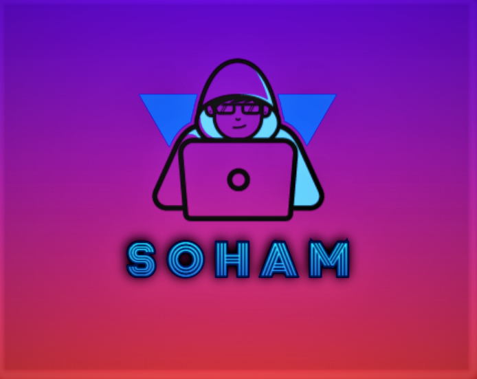
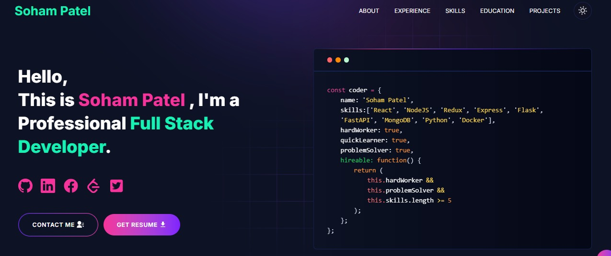

# 🚀 Soham Patel — Developer Portfolio

<p align="center">
  
</p>

<p align="center">
  <strong>Personal portfolio of Soham Patel — Full Stack Developer</strong>
</p>

<p align="center">
  
  
  
  
</p>

<p align="center">
  <a href="https://linkedin.com/in/sohampatel03">LinkedIn</a> •
  <a href="https://github.com/sohampatel03">GitHub</a> •
  <a href="https://x.com/SohamPa66956587">Twitter / X</a>
</p>

---

## 🌐 Live Demo

[>See](https://soham-portfolio-ecru.vercel.app/)

---

## 📸 Preview



---

## ✨ Features

- ⚡ Built with **Next.js 16** App Router + **React 19**
- 🎨 **Dark & Light theme** toggle with smooth transitions
- 💫 **Splash screen** animation on load
- 🃏 **Glow cards** with mouse-tracking effect
- 📱 Fully **responsive** on all screen sizes
- 📬 **Contact form** with Gmail + Telegram notifications
- 🔍 **SEO optimized** via Next.js Metadata API
- 🐳 **Docker support** for easy deployment
- 📊 **Google Tag Manager** support for analytics

---

## 🛠️ Tech Stack

| Category       | Technologies Used                                      |
|----------------|--------------------------------------------------------|
| **Framework**  | Next.js 16, React 19                                   |
| **Styling**    | Tailwind CSS 4, SASS/SCSS                              |
| **Animations** | Lottie React, Framer Motion (CSS keyframes)            |
| **Backend**    | Next.js API Routes, Nodemailer, Axios                  |
| **Deployment** | Vercel / Netlify / Docker                              |
| **Notifications** | Gmail (Nodemailer), Telegram Bot API               |
| **Other**      | React Fast Marquee, React Toastify, React Icons        |

---

## 📁 Project Structure

```
developer-portfolio/
├── app/
│   ├── api/
│   │   └── contact/        # Contact form API (Gmail + Telegram)
│   ├── components/
│   │   ├── homepage/
│   │   │   ├── about/      # About Me section
│   │   │   ├── contact/    # Contact section + form
│   │   │   ├── education/  # Education section
│   │   │   ├── experience/ # Experience section
│   │   │   ├── hero-section/ # Landing hero
│   │   │   ├── projects/   # Projects section
│   │   │   └── skills/     # Skills marquee
│   │   ├── helper/
│   │   │   ├── animation-lottie.jsx
│   │   │   ├── glow-card.jsx
│   │   │   └── scroll-to-top.jsx
│   │   ├── navbar.jsx      # Navbar + theme toggle
│   │   ├── footer.jsx
│   │   └── splash-screen.jsx
│   ├── css/
│   │   ├── globals.scss    # CSS variables (dark/light theme)
│   │   └── card.scss       # Glow card styles
│   ├── layout.js           # Root layout + metadata
│   └── page.js             # Home page
├── public/
│   ├── profile.png         # Your profile photo ← ADD THIS
│   ├── resume.pdf          # Your resume ← ADD THIS
│   ├── logo-soham.png      # Splash screen logo
│   └── image/              # Project screenshots ← ADD THESE
├── utils/
│   ├── data/
│   │   ├── personal-data.js    # ← Your info
│   │   ├── experience.js       # ← Your internships
│   │   ├── educations.js       # ← Your education
│   │   ├── projects-data.js    # ← Your projects
│   │   ├── skills.js           # ← Your skills
│   │   └── contactsData.js     # ← Your contact info
│   ├── skill-image.js      # Maps skill name → SVG icon
│   └── check-email.js      # Email validation helper
├── .env                    # Environment variables (never commit!)
├── .env.example            # Template for env vars
├── next.config.js
├── tailwind.config.js
├── postcss.config.js
├── Dockerfile.dev
├── Dockerfile.prod
└── docker-compose.yml
```

---

## ⚙️ Local Setup

### Prerequisites
- Node.js >= 20.9.0
- pnpm (recommended) or npm

### Steps

```bash
# 1. Clone the repo
git clone https://github.com/sohampatel03/<your-repo-name>.git
cd <your-repo-name>

# 2. Install dependencies
pnpm install

# 3. Setup environment variables
cp .env.example .env
# Fill in your values (see below)

# 4. Run development server
pnpm dev
```

Open [http://localhost:3000](http://localhost:3000)

---

## 🔐 Environment Variables

Create a `.env` file in the root:

```env
# Your deployed portfolio URL (required for contact form)
NEXT_PUBLIC_APP_URL=https://your-portfolio.vercel.app

# Gmail (required to receive contact form emails)
EMAIL_ADDRESS=soham171203@gmail.com
GMAIL_PASSKEY=your_gmail_app_password

# Telegram (optional — for contact form notifications)
TELEGRAM_BOT_TOKEN=your_bot_token
TELEGRAM_CHAT_ID=your_chat_id

# Google Tag Manager (optional — for analytics)
NEXT_PUBLIC_GTM=
```

### How to get Gmail App Password:
1. Go to [myaccount.google.com](https://myaccount.google.com)
2. Security → 2-Step Verification → turn ON
3. Security → App Passwords → generate one
4. Paste the 16-character password in `GMAIL_PASSKEY`

### How to get Telegram Chat ID:
1. Search `@userinfobot` on Telegram → send `/start`
2. It will reply with your Chat ID
3. Also send `/start` to your own bot once

---

## 🚀 Deployment

### Vercel (Recommended)

```bash
# Install Vercel CLI
npm i -g vercel

# Deploy
vercel
```

Or connect your GitHub repo on [vercel.com](https://vercel.com) and add env variables in the dashboard.

### Docker

```bash
# Development
docker-compose up --build

# Production
docker build -t portfolio:prod -f Dockerfile.prod .
docker run -p 3000:3000 portfolio:prod
```

---

## 🎨 Customization Guide

| What to change              | File to edit                              |
|-----------------------------|-------------------------------------------|
| Your name, bio, links       | `utils/data/personal-data.js`            |
| Work experience             | `utils/data/experience.js`               |
| Education                   | `utils/data/educations.js`               |
| Projects                    | `utils/data/projects-data.js`            |
| Skills shown in marquee     | `utils/data/skills.js`                   |
| Theme colors                | `app/css/globals.scss` (CSS variables)   |
| Splash screen logo          | `public/logo-soham.png`                  |
| Profile photo               | `public/profile.png`                     |
| Page title & SEO            | `app/layout.js`                          |

---

## 📚 What I Learned Building This

- **Next.js 15/16 App Router** — layouts, server components, API routes
- **React 19** — new concurrent features, actions
- **Tailwind CSS v4** — utility-first styling without config overhead
- **SCSS + CSS Variables** — dynamic dark/light theming
- **Nodemailer** — sending emails from a Node.js backend
- **Telegram Bot API** — real-time form submission notifications
- **Lottie animations** — lightweight JSON-based animations
- **Docker** — containerizing a Next.js app for consistent deployments
- **Glow card effect** — CSS `conic-gradient` + pointer tracking via JS
- **Splash screen** — CSS keyframe animations with React state control

---

## 🙏 Credits

Base template: [developer-portfolio](https://github.com/said7388/developer-portfolio) by Abu Said  
Customized & extended by **Soham Patel** — added dark/light theme, splash screen, glow cards, personal data, and deployment configuration.

---

## 📄 License

MIT License — see [LICENSE](LICENSE) for details.

---

<p align="center">Made with ❤️ by <a href="https://linkedin.com/in/sohampatel03">Soham Patel</a></p>